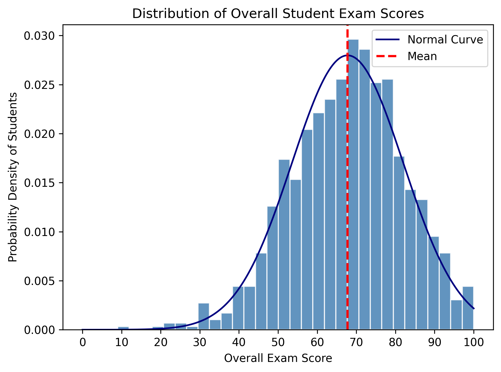
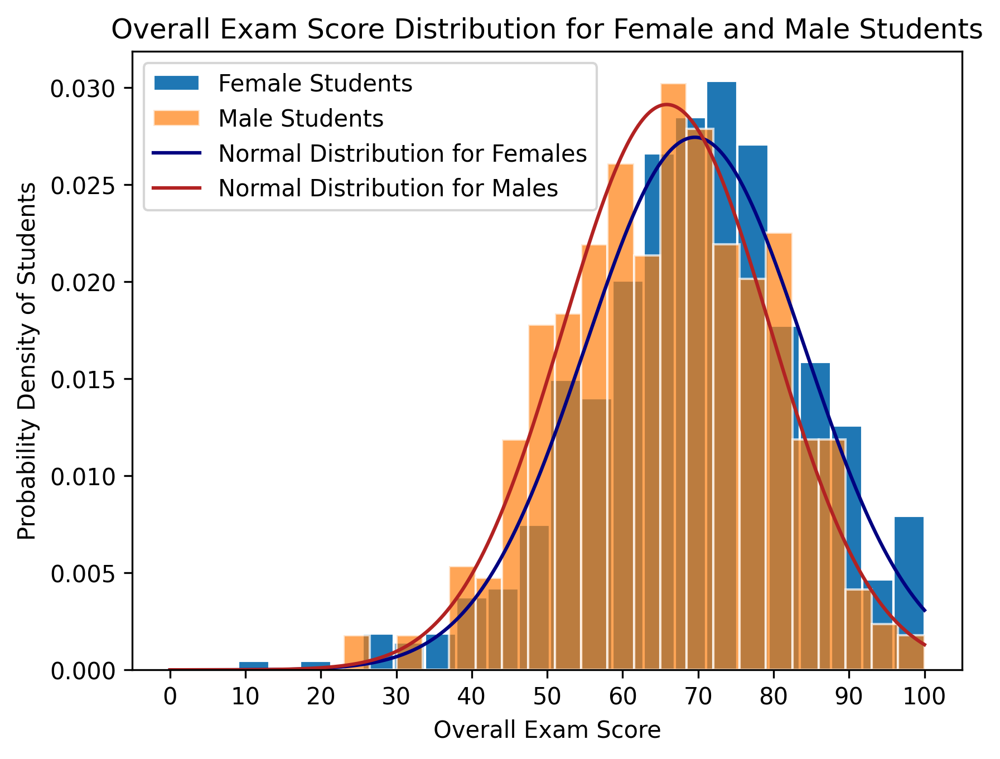
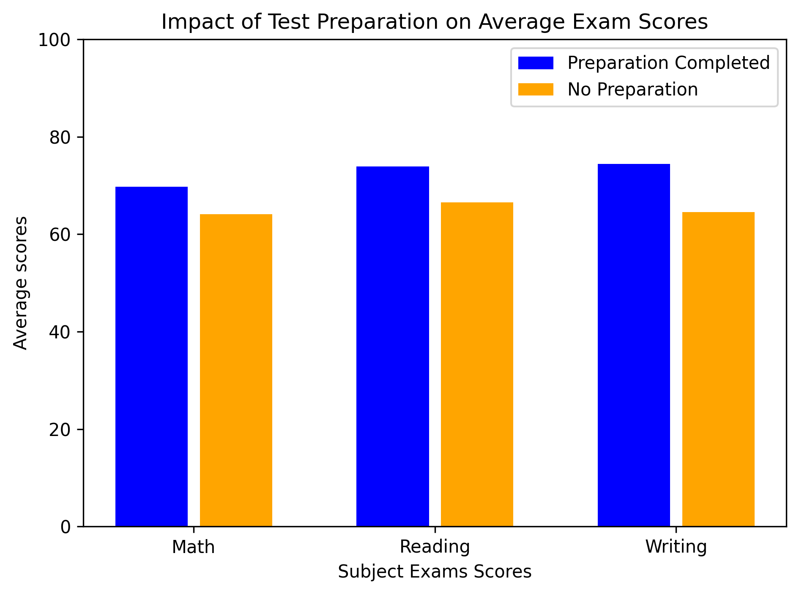
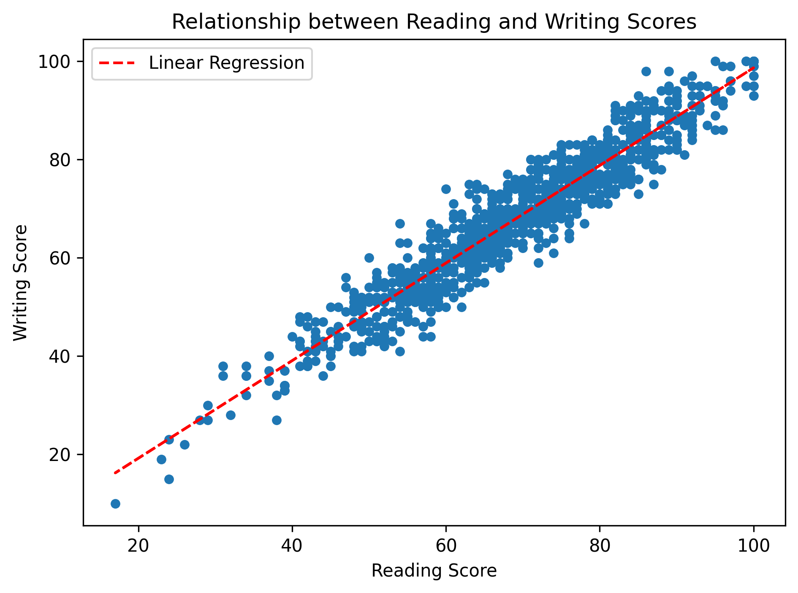
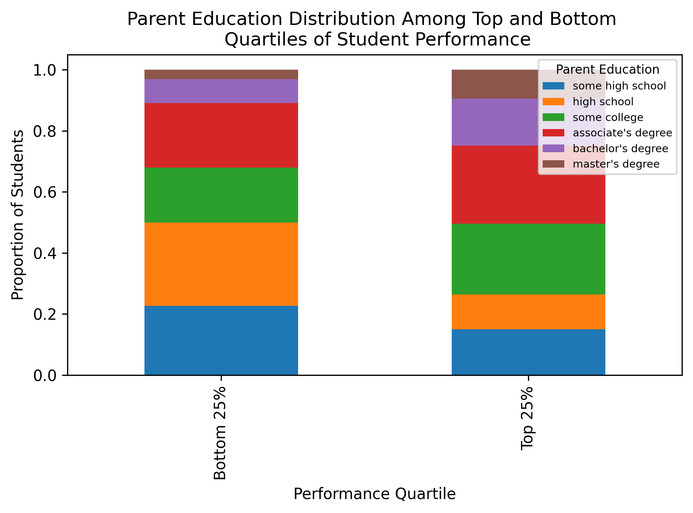

# Dataset
The dataset was sourced from Kaggle and contains exam scores for 1000 students including math, reading, and writing 
scores, along with gender, parent education level, and test preparation completion variables.
# Methodology
An overall performance score was calculated for each student as the average of their math, reading, and writing exam 
scores. This metric was used to analyze the overall score distribution, and to identify how gender, parental education,
and test preparation relate to overall academic performance.
# Visualizations
### Figure 1: Distribution of Overall Student Exam Scores.

**Caption:**
Overall student exam scores follow an approximately normal distribution, with a mean score of 67.77 across all students.
### Figure 2: Overall Exam Score Distribution Between Female and Male Students.

**Caption:**
Both female and male students show an approximate normal distribution for overall exam scores. However, female students 
have a slightly higher average at 69.57 compared to the average male score at 65.84.
### Figure 3: Impact of Test Preparation on Average Exam Scores for Each Subject.

**Caption:**
Students who completed the test preparation achieved higher average score across all subjects compared to students that
did not complete any test preparations.
### Figure 4: Relationship between Reading and Writing Scores

**Caption:**
Reading and writing scores show a strong positive relationship with a correlation of 0.9546, indicating that students 
tend to perform well in either reading or writing will perform similarly in the other.
### Figure 5: Parent Education Distribution Among Top and Bottom Quartiles of Student Performance

**Caption:**
Students in the top performance quartile are more likely to have parents with higher education such as a bachelor's 
degree or a master's degree compared to more students in the bottom performance quartile.